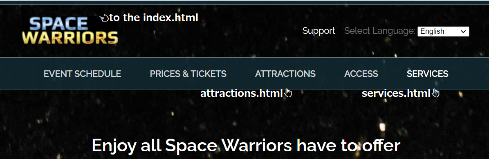

# Midterm Team Assignment cm1040-webdev-t1g0-yed-team15-tg02
UOL: CM1040 Web Development 

## Members
- Abiodun Quadri Adekunle (@Quadri)
- Rui Caneira (@Rui Caneira)
- Akira SAKAGUCHI (@Akira Sakaguchi)
- Philipp A. Gerken (@Philipp A. Gerken) 
*Philipp messaged us, but only after we submitted our work, due to his health condition

On the team but not contributed (no response from the beginning until now..)
- Siyuan Ji

## Files
 - src
   - StyleSheet
     - slider.css
     - style.css
   - images
     - (this dir contains images used in the HTML files)
 - attractions.html
 - index.html
 - services.html

## Working Links on the Website

- "Space Warriors Icon" -> [index.html](https://sharedrreubnpe.labs.coursera.org)
- "Attractions" -> [attractions.html](https://sharedrreubnpe.labs.coursera.org/attractions.html)
- "Services" -> [services.html](https://sharedrreubnpe.labs.coursera.org/services.html)

## Docs

### Team Work 1
Due: 24th May
[Google Doc](./Team_Project_1/UOL_Web_dev_team_work1.pdf)

## Team Work 2
Due: 7th June
[HTML Wireframe](./Team_Project_2/Team_Project_2_HTML_Wireframes.pdf)
[Coursera URL](https://sharedrreubnpe.labs.coursera.org/)

## Team Work 3
Due: 21st June
[HTML Wireframe With CSS Markup](./Team_Project_3/Team_Project_3_HTML_Wireframes_with_CSS.pdf)
[Coursera URL](https://sharedooykupzl.labs.coursera.org)

## Team Work 4
Due: **25th** June (officially 5th July)
[HTML Wireframe With CSS Markup](./Team_Project_4/Team_Project_4_HTML_Wireframes_with_CSS.pdf)
[Coursera URL](https://sharedooykupzl.labs.coursera.org)
